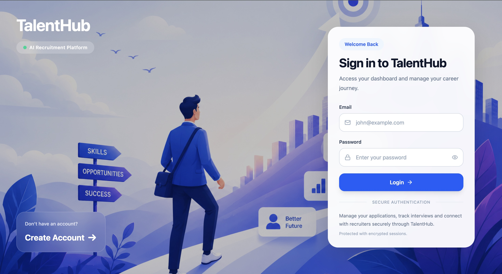
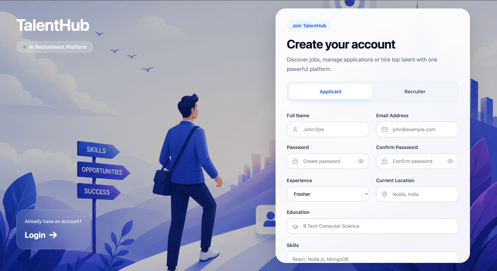
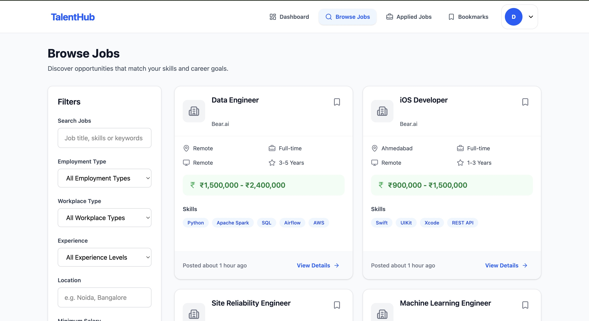
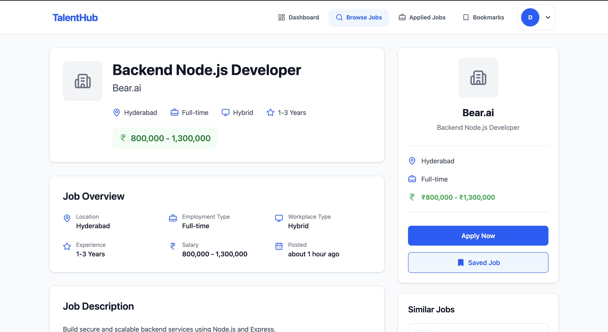
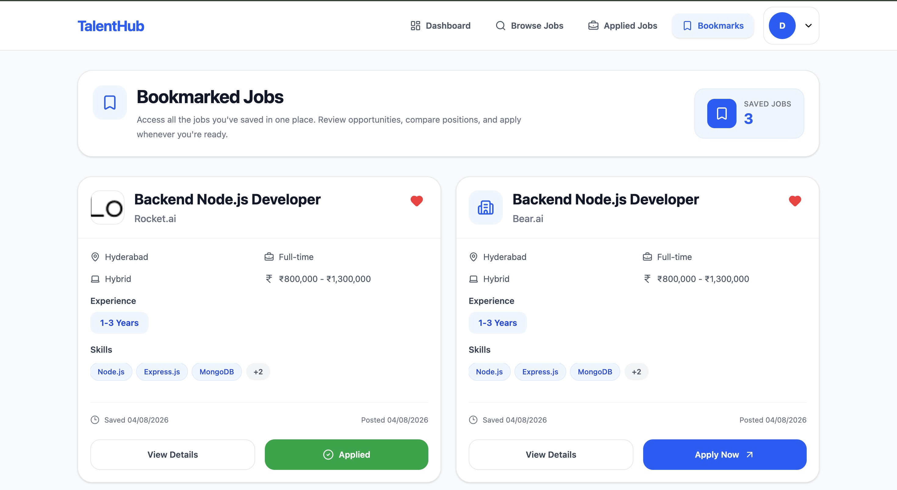
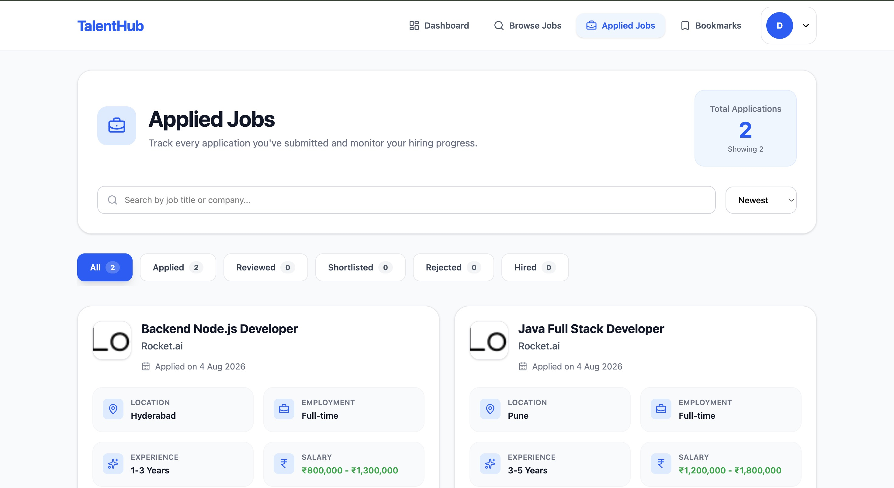
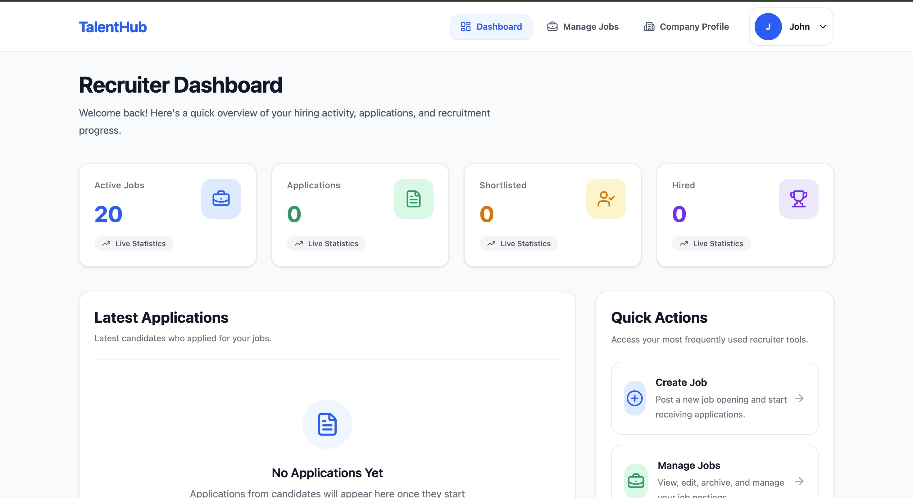
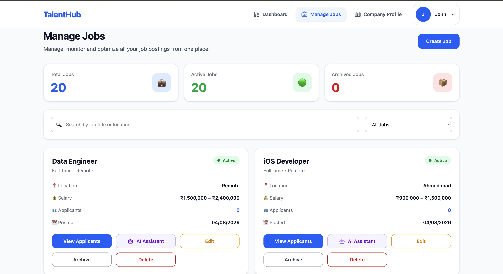
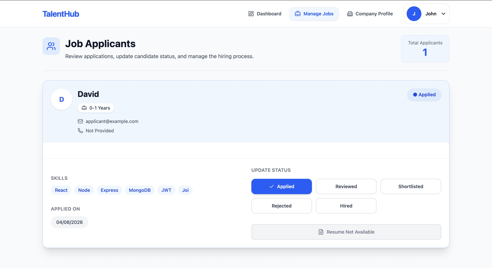
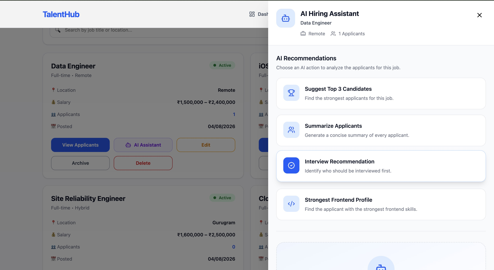

# 🚀 TalentHub – AI Powered Hiring Platform

TalentHub is a **full-stack AI-powered hiring platform** that streamlines the recruitment process for both **Recruiters** and **Applicants**.

Recruiters can create and manage job postings, review applicants, shortlist candidates, and leverage an **AI Hiring Assistant** to make data-driven hiring decisions. Applicants can discover jobs, bookmark opportunities, apply seamlessly, track applications, and prepare for interviews using an **AI Interview Preparation Assistant**.

Built with **React**, **Redux Toolkit**, **Node.js**, **Express.js**, **MongoDB**, **JWT Authentication**, and **Groq Llama 3.3 AI**, TalentHub demonstrates a production-ready MERN architecture with secure authentication, scalable backend design, responsive UI, and AI-powered recruitment workflows.

---

# 🌐 Live Demo

### Frontend

🔗 https://talent-hub-001.vercel.app
### Backend API

🔗 https://talenthub-backend-001.vercel.app

---

# 🔑 Demo Login

## 👨‍💼 Recruiter

> Email: `recruiter@example.com`
>
> Password: `123@Demo`

---

## 👨‍💻 Applicant

> Email: `applicant@example.com`
>
> Password: `123@Demo`

---

# 🎥 Demo Video

Watch the complete walkthrough of TalentHub.

**Demo Video**

https://your-demo-video-link.com

---

# ⚡ Quick Start

Clone the repositories.

```bash
git clone https://github.com/Abdul-Kalam0/TalentHub-Frontend.git

git clone https://github.com/Abdul-Kalam0/TalentHub-Backend.git
```

---

## Install Frontend

```bash
cd TalentHub-Frontend

npm install
```

Run Frontend

```bash
npm run dev
```

---

## Install Backend

```bash
cd TalentHub-Backend

npm install
```

Run Backend

```bash
npm run dev
```

---

# 🛠️ Technologies

## Frontend

- React.js
- React Router DOM
- Redux Toolkit
- Tailwind CSS
- Axios
- React Toastify
- React Markdown
- Lucide React

---

## Backend

- Node.js
- Express.js
- MongoDB
- Mongoose
- Joi Validation

---

## Authentication

- JWT Authentication
- HTTP-only Cookies
- Role-Based Authorization
- Protected Routes

---

## AI

- Groq API
- Llama 3.3 70B Versatile

---

## Deployment

- Vercel
- MongoDB Atlas

---

# 🏗️ System Architecture

## Frontend

```text
Pages
      ↓
Reusable Components
      ↓
Redux Toolkit
      ↓
Axios Services
      ↓
REST APIs
```

---

## Backend

```text
Routes
      ↓
Controllers
      ↓
Services
      ↓
Models
      ↓
MongoDB
```

---

## Database Design

```text
User
│
├── Recruiter
│      │
│      └── Jobs
│              │
│              └── Applications
│
└── Applicant
       │
       ├── Bookmarks
       ├── Applications
       └── Resume
```

---
# ✨ Features

## 🔐 Authentication

### Implemented

- Applicant Registration
- Recruiter Registration
- Common Login
- JWT Authentication
- HTTP-only Cookie Authentication
- Persistent Login
- Protected Routes
- Role-Based Authorization
- Secure Logout

---

# 👨‍💼 Recruiter Features

## 📊 Recruiter Dashboard

Recruiters get a complete overview of their hiring activities.

### Dashboard Analytics

- Active Jobs
- Archived Jobs
- Total Applications
- Total Shortlisted Applicants

### Dashboard Widgets

- Recent Applications
- Quick Navigation
- Hiring Statistics

---

## 💼 Job Management

Recruiters can efficiently manage job postings.

### Features

- Create Job
- Edit Job
- Archive Job
- Delete Job
- View All Posted Jobs
- Manage Job Status

### Validations

- Required Field Validation
- Salary Validation
- Application Deadline Validation
- Backend Joi Validation

---

## 👥 Applicant Management

Recruiters can review and manage applicants for every job.

### Applicant Card Includes

- Applicant Name
- Skills
- Experience
- Resume
- Applied Date
- Current Status

### Actions

- Shortlist Applicant
- Reject Applicant

> Applicant status updates instantly without requiring a page refresh.

---

# 🤖 AI Hiring Assistant

Every job includes an AI Hiring Assistant powered by **Groq Llama 3.3**.

Recruiters can instantly analyze applicants using predefined AI actions.

### AI Actions

- Suggest Top 3 Candidates
- Summarize All Applicants
- Who Should I Interview First?
- Which Applicant Has the Strongest Frontend Profile?

### AI Capabilities

- Uses **only available applicant data**
- No hallucinations
- No invented information
- Structured recommendations
- Professional recruiter-friendly responses
- Applicant ranking with reasons
- Handles insufficient information gracefully

### User Experience

- AI Drawer Interface
- Beautiful Markdown Rendering
- Loading Skeleton
- Error Handling
- Smooth Auto Scroll to Response
- Fully Responsive

---

# 👨‍💻 Applicant Features

## 🔍 Browse Jobs

Applicants can discover opportunities using powerful search and filtering.

### Job Listing

Each job displays:

- Job Title
- Company
- Salary
- Experience
- Employment Type
- Workplace Type
- Location
- Posted Date

---

## 🔎 Search & Filters

### Search

- Search by Job Title
- Search by Keywords

### Filters

- Location
- Salary
- Experience
- Employment Type
- Workplace Type

### Sorting

- Latest
- Oldest
- Highest Salary
- Lowest Salary

---

## 🔗 URL-Based Filter Persistence ⭐

TalentHub preserves all search filters inside the URL.

Example

```text
/jobs?search=react&location=Noida&employmentType=Full-time&salary=1000000&page=2
```

### Benefits

- Refresh-safe filtering
- Shareable URLs
- Browser Back/Forward Support
- Persistent Pagination

---

## 📄 Job Details

Every job includes complete information.

### Displays

- Complete Description
- Responsibilities
- Required Skills
- Salary
- Experience
- Recruiter Information

### Actions

- Apply
- Withdraw Application

---

## 🔖 Bookmarks

Applicants can save jobs for later.

### Features

- Bookmark Jobs
- Remove Bookmark
- Instant UI Update
- Redux State Management

---

## 📝 Applications

Applicants can easily manage their applications.

### Features

- Apply for Jobs
- Withdraw Applications
- Track Application Status
- View Applied Jobs

### Status Tracking

- Applied
- Reviewed
- Shortlisted
- Rejected
- Hired

---

## 👤 Applicant Profile

Applicants can manage their professional profile.

### Profile Information

- Name
- Bio
- Skills
- Experience
- Education
- Resume Upload

---

# 🤖 AI Interview Preparation Assistant

Applicants can prepare for interviews using AI.

Generates

- 5 Likely Interview Questions
- Topics to Revise
- Preparation Tips

### Features

- AI Generated Questions
- Smart Preparation Tips
- Loading States
- Error Handling
- Professional Markdown Output

---

# 📱 User Experience

- Fully Responsive Design
- Modern SaaS UI
- Loading Skeletons
- Empty States
- Toast Notifications
- Smooth Navigation
- Responsive Drawer Components
- Beautiful Cards & Dashboards
- Mobile Friendly
- Accessibility Focused

---

# 📸 Screenshots

## 🏠 Landing Page


---

## 🔐 Login



---

## 📝 Register



---

## 💼 Browse Jobs



---

## 📄 Job Details



---

## 🔖 Saved Jobs



---

## 📑 Applied Jobs



---

## 🤖 AI Interview Preparation


---

## 📊 Recruiter Dashboard



---

## 💼 Manage Jobs



---

## 👥 Job Applicants



---

## 🤖 AI Hiring Assistant



---

## 👤 Applicant Profile


---

## 🏢 Recruiter Profile


---

# 📡 API Reference

## 🔐 Authentication

### POST `/api/auth/register`

Register a new applicant or recruiter.

### Request

```json
{
  "fullName": "John Doe",
  "email": "john@example.com",
  "password": "Password@123",
  "role": "applicant"
}
```

### Response

```json
{
  "success": true,
  "message": "Registration successful."
}
```

---

### POST `/api/auth/login`

Authenticate user.

### Response

```json
{
  "success": true,
  "user": {},
  "token": "jwt_token"
}
```

---

### GET `/api/auth/me`

Retrieve authenticated user.

---

### POST `/api/auth/logout`

Logout current user.

---

# 💼 Jobs

### GET `/api/jobs`

Retrieve all published jobs.

Supports

- Search
- Filters
- Sorting
- Pagination

Example

```http
GET /api/jobs?search=react&location=Noida&page=2
```

---

### GET `/api/jobs/:jobId`

Retrieve a single job.

---

### POST `/api/jobs`

Create a new job.

Recruiter Only

---

### PATCH `/api/jobs/:jobId`

Update a job.

Recruiter Only

---

### PATCH `/api/jobs/:jobId/archive`

Archive a job.

Recruiter Only

---

### DELETE `/api/jobs/:jobId`

Delete a job.

Recruiter Only

---

# 📑 Applications

### POST `/api/jobs/:jobId/apply`

Apply for a job.

---

### GET `/api/applications/me`

Retrieve applicant's applications.

---

### GET `/api/jobs/:jobId/applications`

Retrieve applicants for a job.

Recruiter Only

---

### PATCH `/api/applications/:applicationId/status`

Update applicant status.

Statuses

- Reviewed
- Shortlisted
- Rejected
- Hired

---

### DELETE `/api/applications/:applicationId`

Withdraw application.

---

# 🔖 Bookmarks

### POST `/api/bookmarks/:jobId`

Bookmark a job.

---

### GET `/api/bookmarks`

Retrieve bookmarked jobs.

---

### DELETE `/api/bookmarks/:bookmarkId`

Remove bookmark.

---

# 🤖 AI APIs

## AI Interview Preparation

### POST `/api/ai/interview`

Generate interview preparation.

### Request

```json
{
  "jobId": "job_id"
}
```

---

## AI Hiring Assistant

### POST `/api/jobs/:jobId/ai`

Generate AI hiring recommendations.

### Request

```json
{
  "prompt": "Suggest the top 3 candidates."
}
```

---

# 📁 Folder Structure

```text
TalentHub
│
├── frontend
│   ├── src
│   │
│   ├── components
│   ├── pages
│   ├── redux
│   ├── hooks
│   ├── layouts
│   ├── routes
│   ├── services
│   ├── utils
│   └── assets
│
├── backend
│   ├── controllers
│   ├── services
│   ├── routes
│   ├── models
│   ├── middlewares
│   ├── validations
│   ├── utils
│   ├── config
│   └── constants
│
└── README.md
```

---

# 🔐 Security

TalentHub follows modern backend security practices.

### Authentication

- JWT Authentication
- HTTP-only Cookies
- Protected Routes
- Role-Based Authorization

### Backend Security

- Joi Validation
- Request Validation
- Authorization Checks
- Ownership Validation
- Secure Password Hashing
- Centralized Error Handling

### AI Security

- Prompt Injection Prevention
- AI uses only database context
- No hallucinated applicant information
- Controlled recruiter prompts

---

# 🚀 Performance Optimizations

Implemented throughout the application.

### Frontend

- Redux Toolkit
- useMemo Optimization
- Lazy Loaded Pages
- URL-Based State Persistence
- Optimistic UI Updates

### Backend

- Layered Architecture
- Efficient MongoDB Queries
- Mongoose Populate Optimization
- Service Layer Abstraction

### User Experience

- Skeleton Loading
- Empty States
- Responsive Layouts
- Toast Notifications
- Smooth Scroll
- Error Boundaries

---

# ⭐ Bonus Features

TalentHub includes several additional features beyond the core project requirements.

## 📄 Resume Upload

Applicants can upload and manage their resumes directly from their profile.

### Benefits

- Easy resume management
- Recruiters can access resumes directly
- Improved hiring workflow

---

## 🔗 URL-Based Filter Persistence

Job search filters and pagination are synchronized with the URL.

Example

```text
/jobs?search=react&location=Noida&employmentType=Full-time&page=2
```

### Benefits

- Refresh-safe filters
- Shareable job search links
- Browser Back/Forward support
- Better user experience

---

## 🤖 AI-Powered Hiring Assistant

A modern AI-powered recruiter assistant built using **Groq Llama 3.3**.

Unlike a generic chatbot, the assistant provides structured hiring recommendations using only the available applicant information.

---

# 📊 Project Highlights

## Full Stack MERN Application

- React
- Redux Toolkit
- Express.js
- MongoDB
- JWT Authentication

---

## AI Powered Features

- AI Interview Preparation Assistant
- AI Hiring Assistant
- Groq Llama 3.3 Integration
- Prompt Engineering
- Structured AI Responses

---

## Production Ready Architecture

### Frontend

- Modular Folder Structure
- Reusable Components
- Redux Toolkit
- Axios Service Layer
- Protected Routes
- Responsive UI

---

### Backend

- Clean Layered Architecture
- Routes → Controllers → Services → Models
- Middleware
- Joi Validation
- Centralized Error Handling
- Role-Based Authorization

---

## Recruiter Experience

- Dashboard Analytics
- Job Management
- Applicant Tracking
- AI Candidate Analysis
- Responsive Dashboard

---

## Applicant Experience

- Browse Jobs
- Smart Search
- Advanced Filters
- Bookmark Jobs
- Apply Jobs
- Resume Upload
- AI Interview Preparation

---

## User Experience

- Modern SaaS UI
- Fully Responsive Design
- Loading Skeletons
- Empty States
- Toast Notifications
- AI Loading States
- Smooth Scrolling
- Beautiful Dashboards

---

## Performance

- Redux Toolkit
- Memoization
- Optimized MongoDB Queries
- URL State Persistence
- Efficient API Calls

---

# 🎯 What I Learned

This project significantly improved my understanding of designing and building production-ready full-stack applications.

### Backend

- Clean Layered Architecture
- Service-Based Business Logic
- MongoDB Relationships
- Mongoose Populate
- Transactions & Sessions
- Authorization & Ownership Checks
- Validation using Joi

---

### Frontend

- Redux Toolkit
- Component Reusability
- Responsive Dashboard Design
- URL-Based State Management
- Performance Optimization
- Protected Routing

---

### AI

- Prompt Engineering
- Context-Aware AI Responses
- Preventing Hallucinations
- Markdown Rendering
- AI Error Handling

---

### System Design

Through multiple backend refactors, I understood the importance of planning before implementation.

Key learnings include:

- Database Design
- REST API Design
- Layered Architecture
- ER Diagram Planning
- UML Diagram Planning
- Scalable Folder Structure
- Separation of Concerns

---

# 🚧 Future Improvements

Future enhancements planned for TalentHub include:

## AI

- AI Resume Screening
- AI Job Description Generator
- AI Cover Letter Generator
- AI Resume Score
- AI Skill Gap Analysis

---

## Recruitment

- Interview Scheduling
- Recruiter Notes
- Email Notifications
- Applicant Timeline
- Company Pages

---

## Applicant

- Job Alerts
- Resume Templates
- Saved Searches
- Profile Completion Score

---

## Platform

- Dark Mode
- Real-time Notifications
- Chat between Recruiter & Applicant
- Multi-language Support
- Admin Dashboard
- Analytics Dashboard

---

# 📧 Contact

## Abdul Kalam

**Backend-Focused Full Stack Developer**

📧 Email

abdulkalamblycomp@gmail.com

💻 GitHub

https://github.com/Abdul-Kalam0

🌐 Portfolio

https://abdul-kalam-portfolio.vercel.app/

LinkedIn

https://www.linkedin.com/in/abdulkalam0/

---

# ⭐ Support

If you found this project useful,

⭐ Star this repository

🍴 Fork and contribute

💡 Share your feedback

📢 Share it with others

---

## Thank You ❤️

Thank you for checking out **TalentHub**.

If you have any suggestions or feedback, feel free to open an issue or connect with me.

Happy Coding! 🚀
